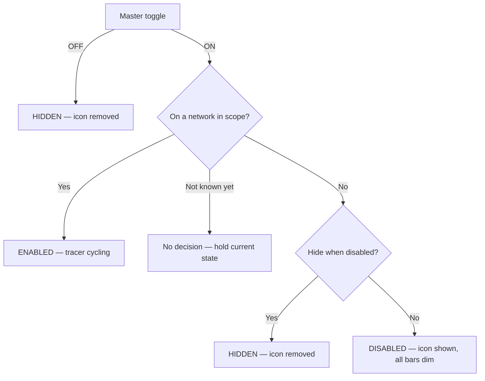

# Ping'd Status Indicator — App Spec

## Overview
Android app that shows a persistent status-bar icon — in the same tray as
the signal-strength / battery icons — indicating uplink health. The icon
is one of 6 fixed frames swapped in place to create a "tracer" effect:
a 5-bar silhouette with either all bars dim, or one bar lit in one of 5
positions. The tracer is driven directly by ping activity rather than by
a separate animation timer.

## Scope
- Persistent status-bar icon (not a home-screen widget).
- Default network scope: any connection (WiFi or cellular, whichever is
  actually carrying traffic). User can narrow scope to WiFi only or
  cellular only, or whitelist specific SSIDs — see [User
  Preferences](#user-preferences).
- Discrete icon-frame swaps only — no smooth/animated rendering.
- No *adaptive* back-off on ping retry — retries are floored at a small
  fixed delay for battery reasons (see [Core
  Mechanism](#core-mechanism--probe-driven-tracer)), but that floor
  never grows with a longer outage.

## Implementation Baseline
Locked decisions — not open questions:
- **Language/UI:** Kotlin, Jetpack Compose for all in-app UI (settings
  screen and anything else the user navigates to). Compose doesn't
  apply to the notification itself or the foreground service — those
  are standard Android notification/service APIs regardless of UI
  toolkit.
- **`minSdk` 34 (Android 14), `targetSdk` latest stable at build time.**
  No pre-14 compatibility path — this removes an entire category of
  legacy foreground-service-type branching the spec would otherwise
  need to account for, and matches the only device available for real
  testing (see below).
- **Preferences:** Jetpack DataStore (Preferences DataStore), not
  SharedPreferences.
- **Test device:** Google Pixel 6 Pro, Android 14+. This is the only
  hardware available for real-device validation — the device-testing
  protocol targets it specifically. Multi-OEM battery-management
  variance (Samsung, Xiaomi, etc.) is a known real-world risk category
  that this protocol cannot cover without that hardware; it's an
  explicit scope limit of testing, not a shortcut in the app itself.
- **Internal module/package structure** is intentionally left to
  implementation judgment rather than dictated here — reviewed for
  soundness rather than prescribed. The one hard requirement: the probe
  and tracer/ack state-machine logic must be plain Kotlin with no
  Android framework dependency, so it's unit-testable on the JVM
  without instrumentation.

## Icon States (6 total)

| Icon               | Frame                                    | Meaning                                  |
| ------------------ | ----------------------------------------- | ----------------------------------------- |
| `ic_scan_disabled` | 5-bar silhouette, all bars dim            | Tracer paused (see state logic below)     |
| `ic_scan_1`         | 5-bar silhouette, bar 1 lit               | Tracer position 1                         |
| `ic_scan_2`         | 5-bar silhouette, bar 2 lit               | Tracer position 2                         |
| `ic_scan_3`         | 5-bar silhouette, bar 3 lit               | Tracer position 3                         |
| `ic_scan_4`         | 5-bar silhouette, bar 4 lit               | Tracer position 4                         |
| `ic_scan_5`         | 5-bar silhouette, bar 5 lit               | Tracer position 5                         |

All six are the same 5-bar shape — only the fill changes. Vector
drawables, ~24x24dp, single-color silhouette, transparent background,
following standard notification icon guidelines. Duotone is achieved
through alpha only (dim bars at 0.3, the lit bar at 1.0), never through
a second fill color — the status-bar small-icon slot flattens any real
color to a single OS-applied tint and only respects alpha, so a
same-tint opacity difference is the only way to get the dim/lit look to
actually survive being rendered there.

The vector drawables for all 6 frames (`ic_scan_disabled.xml`,
`ic_scan_1.xml` … `ic_scan_5.xml`) live in `app/src/main/res/drawable/`,
where the notification-building code references them as ordinary Android
resources.

"Hidden" is **not** a 7th icon — it's the absence of the icon (nothing
shown in the status bar).

## Core Mechanism — Probe-Driven Tracer
The tracer advances one bar position per "ack." Acks come from two
sources: a successful probe response, and a fixed timer that fires
between steps. There is no separate animation loop and no formula that
scales speed by latency — latency is simply how long a probe attempt
takes to return.

**The sweep is a ping-pong bounce, not a wrap.** The lit bar moves
1→2→3→4→5, then reverses and moves back down 5→4→3→2→1, then reverses
again — never jumping straight from bar 5 back to bar 1. Bar 1 and bar
5 each appear once per direction change, not twice in a row. This is a
KITT/scanner-style motion.

**Probe, not ICMP.** Unprivileged Android apps can't open raw ICMP
sockets (no `CAP_NET_RAW`), so "ping" here is a plain TCP connect-time
probe: open a `Socket` to the target host on port 443, time how long
`connect()` takes, then close it immediately without sending or
receiving any payload. One round trip, same shape as an ICMP echo,
works under the ordinary `INTERNET` permission. (Shelling out to
`/system/bin/ping` and parsing its text output was considered and
rejected — output format isn't stable across OEMs/Android versions.)

The default probe target is a **hostname**, not a bare IP literal —
`one.one.one.one` (Cloudflare) as the default, `dns.google` offered as
an alternate quick-pick, custom host override supported. Resolving a
hostname lets the OS pick whichever address family the network actually
supports; a hardcoded IPv4 literal simply fails on an IPv6-only/NAT64
network and looks indistinguishable from a real outage. If the custom
override is a hostname and it fails to resolve, treat that as a distinct
"can't resolve target" condition rather than folding it into the
generic probe-failure case — a DNS problem and a network-down problem
shouldn't look the same to the user.

Cycle, repeating while enabled — **ping, ping, fake**, not a strict 1:1
alternation:

1. Open a probe (TCP connect to the target host:443, timeout: 1000ms).
2. Probe succeeds → **ack** → tracer advances one step, icon updates.
   A slower response means a longer visible pause on this step — that
   delay *is* the latency indicator, nothing else scales it.
3. Wait the step delay (see below) → back to step 1 for a second real
   probe.
4. Second probe succeeds → **ack** → tracer advances another step.
5. Wait the step delay → **ack** (automatic, no real probe) → tracer
   advances a third step.
6. Wait the step delay (no ack) → back to step 1.

Two real probes before each automatic ack, not one, deliberately: a
strict ping/fake/ping/fake alternation makes every freeze (see below)
land in the same phase of the bounce, so an outage always stops the
tracer on the same handful of bars. Breaking the 1:1 alternation
spreads freezes across more of the sweep instead.

**Step delay:** the wait between every step above — after a real ack,
after the automatic ack, and before the next probe — is one **user-
configurable** value, not a fixed 500ms. Settings screen: a slider,
0–1000ms, default 500ms. 0ms means back-to-back with no added wait
("free wheeling") — each step still takes however long its own probe
attempt does, but nothing artificially paces them further apart. The
same value governs every step; there's no separate rate for the real
vs. the automatic step.

**On probe timeout/failure:** no ack fires. The tracer freezes on its
current bar — it does not advance and does not show a distinct "lost"
frame. A retry is scheduled after a fixed **250ms floor delay** (same
1000ms timeout on the retry itself) — not the step delay above, and not
zero either, despite "no back-off": a failure that takes close to the
full 1000ms timeout to arrive (an ordinary "target isn't answering"
outage) barely notices a 250ms floor, but a DNS-resolution failure can
return in low single-digit milliseconds — exactly the condition seen
for a moment while reconnecting after a total outage, before the
resolver is reachable again. Without a floor, a burst of those spins
the retry loop as fast as the CPU allows for as long as the burst
lasts, a real, measured on-device battery cost. The floor is fixed, not
growing with a longer outage — still not "adaptive" back-off, which
remains out of scope (see [Explicitly Out of
Scope](#explicitly-out-of-scope-v1)). Retries continue, floored this
way, until one succeeds, at which point acks resume and the tracer
continues from wherever it froze. A failure does not consume a slot in
the ping/ping/fake sequence — the sequence only advances on a real ack,
so an outage mid-sequence resumes at the same point once connectivity
returns, rather than restarting the pattern.

## Bar Position Persistence
Position and remembered latency/freeze state persist only for the
lifetime of the current probe cycle. Any transition into `ENABLED` from
a not-running state — a fresh app/process start, or resuming after
`DISABLED`/`HIDDEN` within the same process — starts a new cycle and
resets to bar 1; neither is restored from preferences.

## Enabled / Disabled / Hidden — State Logic
The master toggle is checked first and is unconditional; the network
scope check (and the hide-when-disabled preference) only ever comes into
play once the master toggle is on.

- **Master toggle off → `HIDDEN`, always.** This is the whole-app
  off switch; nothing else overrides it. It resolves immediately even
  when the network state is still unknown, because this branch never
  consults the network at all.
- **Master toggle on, network in scope → `ENABLED`.** Ping-driven
  tracer runs as described above.
- **Master toggle on, network out of scope →** the *hide when
  disabled* preference decides between `HIDDEN` (icon removed) and
  `DISABLED` (icon shown, all bars dim, tracer paused).
- **Master toggle on, network scope not yet known → no decision.**
  "Connectivity hasn't reported anything yet" is a third input state,
  distinct from "reported, and we are not on a network in scope." Only
  the latter is grounds for `DISABLED`/`HIDDEN`. The connectivity layer
  keeps this window as close to zero as possible by reading the
  platform's *current* networks — the whole set, and the default route —
  synchronously when it subscribes, rather than waiting on the first
  `NetworkCallback` to arrive, so the first decision is correct even if
  those callbacks are slow or never come. Deriving a real, user-visible
  verdict from the mere absence of a report would otherwise leave a
  fresh install sitting on the paused tracer until the master toggle was
  cycled off and on.

## In-App Status Line
The settings screen carries a one-line, plain-language status field
("Status: connected, 42ms") describing what the service is doing right
now. It exists to be a small honest log the user can glance at, so its
one hard requirement is that everything it says is true at the moment it
says it — a status field that is merely present, and technically holds
text, is worse than none at all.

It is therefore fed by a closed set of confirmed states, each reported
from exactly one real transition:

| State                                                 | Reported when                                                              |
| ----------------------------------------------------- | -------------------------------------------------------------------------- |
| starting up                                            | the service has started; no visibility decision has been reached yet        |
| checking the connection                                | `ENABLED` applied and the cycle started; no probe has completed yet         |
| connected, *N*ms                                       | a probe answered (or the automatic ack that follows one fired)              |
| connection trouble / can't resolve the target host     | a probe attempt failed, named by which kind of failure it was               |
| paused / waiting for a whitelisted Wi-Fi network       | `DISABLED` applied                                                          |
| hidden                                                 | `HIDDEN` applied                                                            |
| stopped                                                | the service instance was destroyed, so nothing will update the field again  |

Until the first confirmed state arrives there is no status line on
screen at all, rather than a default or placeholder one.

Notification content never feeds this field. The notification is a
separate surface with a different obligation: Android requires one to be
posted immediately on service start, before anything has been decided,
so it necessarily carries a placeholder — and a notification built to
meet an API deadline is not evidence of a state having been reached.
That placeholder accordingly states no verdict ("Ping'd: starting…")
rather than naming a network condition. For the same reason the first
notification of a fresh cycle reads "checking connection," not
"connected": the tracer sits at bar 1 because the cycle just started,
not because anything answered.

## In-App Scanner Preview
The settings screen also carries a live visual duplicate of the
status-bar icon itself, centered horizontally at the top of the screen
at roughly a quarter of the screen's width. It exists so the icon's
current frame is visible while looking at the settings screen, without
having to pull down the notification shade or glance at the status bar.

Its one hard requirement mirrors the status line's: it must always show
literally the same frame the notification is showing, not a separate
animation or a second interpretation of the tracer's state derived some
other way. It is fed from the same drawable resource the notification's
icon was just built from, updated at the same moment — never computed
independently from bar position or visibility state.

When the real icon is absent (`HIDDEN`), the preview shows nothing at
all, the same way the status bar does — this is not a seventh frame any
more than the notification's own dim-all-bars frame is, per [Icon
States](#icon-states-6-total) above. Whenever the master toggle is off,
this is what applies.

## In-App History Graphs
The settings screen carries two live rolling graphs, immediately below
the scanner preview and above the rest of the settings — a ping success
percentage and a latency trend, both over a shared, user-configurable
history window (default 7 minutes, matching Starlink's own status
display, which this is modeled on).

Both graphs are driven by real probe attempts only — the TCP-connect
probes described in [Core Mechanism](#core-mechanism--probe-driven-tracer)
above. The automatic ("fake") ack in the ping/ping/fake cycle is not a
probe attempt and contributes no sample to either graph; counting it
would silently inflate the success percentage and misrepresent the
latency trend with data that was never actually measured.

- **Ping success (%)** — the percentage of real probe attempts, within
  the window, that succeeded. Every real attempt counts, success or
  failure — including every retry during a sustained outage.
- **Latency (ms)** — a windowed trend line built from successful
  probes' measured round-trip time. A failed probe is a **gap** in the
  line, not a zero and not a skipped/interpolated point — a gap is the
  honest representation of "no measurement," the same principle the
  tracer's own freeze-in-place behavior already follows for a single
  failed probe. Vertical position is on a **fixed, absolute** scale —
  the same green→yellow→red anchors described under "Coloring" below
  (50ms/200ms/400ms) — with **fast plotting near the top and slow near
  the bottom**: "up" reads as "better," and, because the scale is fixed
  rather than scaled to this session's own observed range, a given
  latency value always plots at the same height regardless of what else
  has happened in the session. A latency at or beyond the red anchor
  clamps to the bottom of the chart rather than plotting off-canvas or
  needing a special case, the same way one at or below the green anchor
  clamps to the top.

A gap in the **latency** line, bounded by real data on at least one side
(a mid-outage or still-ongoing loss of signal, not the graph simply not
having filled up yet), is additionally shaded, not just left as a break
in the line — a break with nothing else marking it reads as a rendering
glitch rather than a deliberate "nothing was measured here." A gap at
the very start of the window is deliberately left unshaded: it's
indistinguishable from the window still filling up (the normal,
expected look early in a session), and shading it would misrepresent
ordinary warm-up as a lost signal.

**The success line has no gap concept at all — no shading, no break.**
A time bucket with zero real attempts in it is treated exactly as if
every attempt in it had failed: it plots at 0%, a dip connected normally
to its neighbors, with nothing visually distinguishing "nothing was
attempted here" from "everything attempted here failed." (An earlier
version of this graph tried to draw that distinction — shading a bucket
only when an adaptive, real-sample-timestamp-based threshold judged the
silence "genuine" rather than an artifact of the bucket grid outrunning
real sample density — but it still produced an on-device report of a
shaded "no data" region sitting in the middle of otherwise-real data.
The distinction itself was the problem: from the user's point of view,
"no data" and "failed" are not different enough to deserve different
treatment, so the success graph no longer tries to tell them apart.)

The one exception: the run of buckets before the very first real sample
recorded anywhere in the currently displayed window stays blank —
omitted from the line entirely, not a 0% dip. That boundary is the same
one the ping-success card's own big number already draws (see the
"before the first probe" note below): collapsing ordinary session
warm-up — the normal look for, e.g., the first few seconds after a
fresh install — into a flatlined "0% loss" would misrepresent "hasn't
started checking yet" as "actively failing," which is a worse,
more misleading result than the shaded-gap flicker this simplification
replaces.

The success line divides the configured window into a number of
buckets, each a **fixed, absolute slot of wall-clock time** — not a
fraction of distance from "now." A real sample's bucket is a permanent
fact about that sample's own timestamp, unaffected by when the line
happens to be redrawn. This replaced an earlier version that instead
measured each sample's position as a fraction of distance from the
newest retained sample and multiplied that fraction by the bucket count
to get an index — boundaries defined that way are, in effect, anchored
to "now," which advances on every single new sample, so a sample
sitting near a boundary could flip to a neighboring bucket on almost
any tick purely because time passed, with nothing about the connection
actually changing. Since a bucket's displayed value is a discrete
average over a handful of real samples, one sample migrating in or out
could swing that bucket's percentage sharply and instantly — reported
on-device as the whole line "reshaping" every tick instead of
scrolling, worse at narrow windows and slow ping-pacing settings where
each bucket has fewer samples behind it, and confirmed by porting the
exact old algorithm into a standalone simulation: single-tick swings of
tens of percentage points in a bucket with nothing real going on, up to
100 points at narrow-window/slow-pacing settings. Binning by a fixed
absolute slot instead means a bucket's membership is a pure function of
*which real samples exist* — a bucket safely in the interior of the
display (not the live bucket still accumulating samples, and not within
one bucket-width of aging off the window's trailing edge) is therefore
provably frozen once no more samples can land in it, confirmed by a
swept simulation of window sizes and ping-pacing settings producing
zero value changes in any such bucket.

**Bucket *width* is a fixed constant, never a function of the
configured window.** An earlier version computed it as `windowMs /
48` — so every edit to the "History window" slider changed every
bucket's width, which reassigns *every* retained sample to a different
bucket: a full rebin, not a rescale, silently undoing the fixed-slot
value-stability the paragraph above describes, just triggered by a
settings change instead of the passage of time. The width is now a
true constant instead, so a sample's bucket depends only on its own
timestamp and the session's own start (see "session warm-up" below),
never on the currently configured window. This is the specific
behavior the success and latency graphs now "share": neither one ever
reassigns a real sample to a different bucket just because the window
slider moved. (The latency graph never had this problem in the first
place — it plots one point per sample with no binning at all, so there
was nothing for it to rebin.)

**What that constant should actually be took two rounds to get right.**
The first version anchored it at the *default* 7-minute window and its
old default bucket count (48) — about 8.75 seconds. That rendered the
default view identically to the fixed-48-bucket grid it replaced, but
left the *narrowest* configurable window (1 minute) starved of
resolution: at that width, a 1-minute window holds only ~7 total
buckets, all of which (warm-up included) resolve within roughly 9-15
real seconds — so the display raced to its final shape in about a
quarter of the window it was supposedly covering, and thereafter only
scrolled once every ~8.75 seconds, a visibly chunkier cadence than the
latency line's continuous per-sample motion right next to it. Both
were reported from the same on-device session at the 1-minute window
setting specifically, and both trace to the same root cause: a single
global width constant can only be "enough resolution" for the window it
was sized against, and the default-anchored version was sized against
the wrong end of the configurable range. (This exact risk was flagged
as an open question before the default-anchored version was first
built — "the 1-minute end of the slider gives a coarser ~7 bins... I'd
want whoever implements this to weigh in" — but shipped anchored at the
default anyway for lack of on-device evidence that the narrow end was a
real problem. This report is that evidence.)

The fix re-anchors the constant at the *narrowest* configurable window
(1 minute) instead — the end of the range where responsiveness matters
most, since a bucket-width-sized wait there is the largest fraction of
the whole window. But the anchor's own bucket-count target could not
simply be turned up for more resolution: [successSparkline]'s ordinary,
post-warm-up grid treats an empty bucket as an unconditional 0% miss
(see below), which is only honest if the bucket is wide enough that
ordinary pacing could never leave it empty on a healthy connection. A
single real gap between two consecutive successful probes that reaches
or exceeds the bucket width can straddle an entire bucket and leave it
empty even though nothing failed — the exact false-positive-outage
problem the warm-up ladder below has its own dedicated fix for, just
relocated to the *permanent* grid, where no such exception is allowed.
This was not hypothetical: a first attempt at the narrow-window fix
(48 buckets at the 1-minute window, ~1.25-second buckets) reproduced
this exact failure directly in testing, at realistic slower pacing
(1.5-2 second step delays) — a reliable, not rare, false dip on an
all-success stream. The app's own worst-case realistic gap between two
real probes is 2 seconds (twice the step-delay slider's own 1-second
ceiling — see the "ping, ping, fake" cycle above: two real probes per
automatic ack, so the gap from an automatic ack back to the next real
probe is two step-delay waits, the largest the cycle ever produces).
The shipped fix instead targets 20 buckets at the 1-minute window —
3-second-wide buckets — clearing that 2-second floor with a deliberate
~50% safety margin for real-world pacing jitter, while still cutting
the old cadence (~8.75 seconds) by roughly two-thirds.

Bucket *count*, in consequence, is no longer pinned at any single
number — with width fixed, it's simply how many of those fixed-width
slots fit in the configured window: 20 at the narrowest configurable
1-minute window (by construction), 140 at the default 7-minute window
(itself a one-time step up in the default view's own resolution from
the 48 it rendered under the first, default-anchored version — more
buckets is never a worse graph, only a finer one), and 600 at the
widest configurable 30-minute one. This is a *different* kind of
bucket-count variation than the attempt-count-driven one described and
rejected two paragraphs below: count still never depends on attempt
count, or on when the line happens to be redrawn — only on the
configured window, which is exactly as stable a basis as a pinned
count used to be. None of this is a performance concern: this is
small-array arithmetic on the main/UI thread from Compose state, not a
hot path at any of these sizes, confirmed rather than assumed for the
now-larger widest-window count by this fix's own test coverage.

Whatever that count comes out to, the display is guaranteed to reach
back far enough to cover every real sample the window is currently
showing — every retained sample the "Ping success (%)" big number and
`attemptCount` already count toward the percentage is also represented
in exactly one displayed bucket, unconditionally. (An interim version
of this guarantee tried to special-case only the session-warm-up part
of this problem, by comparing raw slot numbers to decide whether a
correction was needed — a comparison that was a false negative exactly
at the boundary it existed to detect, and repeatedly dropped real
warm-up-era data from the line for a substantial stretch of ticks in
ordinary use, confirmed by an independent simulation sweeping window
sizes and pacing intervals. The fix that shipped instead is
unconditional: the display's left edge is always at least as far back
as the earliest currently-windowed sample's own bucket, full stop, with
no threshold to get wrong.)

How many of a display's fixed slots actually have real attempts behind
them is a separate question the no-gaps/pre-first-sample rules above
already answer. An earlier version grew the bucket count itself with
how much of the window real elapsed time had covered, specifically to
avoid scattering a handful of early-session samples across mostly-empty
buckets — for the steady-state (post-warm-up) part of a session, that
growing-resolution behavior is a side effect of the pre-first-sample
rule alone: most fixed slots simply sit before the first real sample
and are omitted, so only the slots with real data behind them get
drawn. Whatever that leaves visible, a zero-attempt bucket in the
**ordinary, post-warm-up grid** is always a miss, never a decision
about whether the silence behind it was "genuine" — with one further
exception, specific to warm-up itself, described next.

**Session warm-up: resolution starts fine and coarsens into the fixed
grid.** A fresh session's very first fixed-width bucket can span the
*entire* bucket width — several seconds at the default width — before
a second ordinary bucket ever opens, which without more shows one
flatlined point pinned at the right edge for that whole stretch
instead of the steadily "filling in" look the rest of this section
describes. Rather than wait a full bucket-width of real time for a
second point to appear, that first bucket is subdivided into six
progressively wider sub-buckets — an exponential/doubling ladder
anchored to the timestamp of the very first real sample ever recorded
in the session, starting near 47ms (fine enough to give distinct
points to typical probe pacing) and doubling five times up to the full
3-second bucket width, at which point every later sample uses the
ordinary fixed grid with no subdivision at all, permanently, for the
rest of the session. Each sample's warm-up sub-bucket, like every
other bucket assignment on this graph, is a permanent fact decided
once from its own timestamp — never recomputed from how many samples
currently exist, which is exactly the property that would reintroduce
the reshaping bug the fixed-slot design above exists to prevent, just
scoped to session start instead of scoped to every tick.

**An empty warm-up sub-bucket is left blank, not plotted as a 0% miss
— the one place on this graph the ordinary no-gaps rule doesn't
apply.** The warm-up ladder's finest levels (as narrow as ~47ms at
the production bucket width) are routinely narrower than any realistic
real-world probe pacing (the app's configurable step delay, roughly
doubled by the tracer's own cycle structure, runs from a few hundred
milliseconds to a few seconds between attempts), so it is *ordinary*,
not rare, for two genuinely consecutive real attempts to land in
non-adjacent warm-up levels, leaving one or more levels between them
with no attempt in it — confirmed by simulating an all-success session
at every configurable pacing setting: at anything slower than the
fastest setting, 2-3 fabricated failure dips appeared scattered
through the first several seconds of an otherwise perfectly healthy
connection's graph, consistently, not as a rare coincidence. This is
*not* the adaptive, per-gap "does this silence look real" judgment
call the ordinary grid's own history already tried and explicitly
rejected (see the no-gaps rule above) — it's a fixed, permanent,
unconditional fact about which slots even *exist* during warm-up,
decided the same way every other bucket boundary on this graph is
decided (from timestamps alone, never from how many attempts did or
didn't arrive). It's also never a way to hide a real outage: every
attempt the tracer makes is recorded, success or failure, at a bounded
pace even during a sustained outage (see "Recording continues through
DISABLED" below and the retry-floor discussion under "Core
Mechanism"), so an empty warm-up sub-bucket can only mean "no attempt
has landed in this narrow a slice yet" — never "an outage happened
here and nothing was recorded," a distinction the ordinary grid's much
wider buckets cannot make the same guarantee about.

Both sparklines' time axis is anchored to the *configured window*, not
stretched to fill from whatever span of samples happens to be displayed
so far. The newest retained sample always sits at the right edge; a
handful of recent samples early in a session (or just after a reset, or
just after narrowing the window) sit clustered near that edge with
real empty space to their left, and the line only spans the full width
once the window is genuinely full — the same behavior a strip chart or
oscilloscope trace has. Scaling to the displayed span instead (an earlier
version of this behavior) stretched however little data existed to fill
the whole card every time, which looked exactly like the graph had just
reset even when nothing was actually cleared.

**The two graphs place a given moment in time at the same horizontal
position, so they read as two views of one synchronized timeline.**
Every point on both graphs is positioned on that same window-anchored
real-time axis — the latency line always was (one point per sample, at
that sample's own real-time position), and the success line's *buckets*
now are too: each displayed bucket's horizontal position is derived from
its own real timestamp (its right edge, the same closed-on-the-right
boundary the bucket grid already uses elsewhere), not from its position
in the array of currently-displayed buckets. An earlier version used
that array-index position instead — `index / (bucket count - 1)` — which
only coincidentally matched the real-time axis when the number of
displayed buckets happened to equal the nominal `window ÷ bucket width`
almost exactly. It routinely didn't: both the warm-up ladder's narrower
sub-buckets and the full-coverage guarantee (which can widen the display
by an extra bucket rather than silently drop real data — see above) push
the actual displayed bucket count above that nominal figure without the
index-to-position mapping compensating, so a bucket's array position no
longer corresponded to the same real-time fraction the latency graph
would place that same moment at. Measured directly (by comparing the old
index-based position against the real-time position for the same
timestamp): up to 23-25% of the graph's total width apart during a
session's warm-up period, and a persistent ~4% offset even in ordinary
steady state at the default window — both large enough that a moment
plotted near the middle of the latency graph could land a quarter of the
screen off on the success graph, which is exactly why the two graphs
failed to visually "scroll together." Deriving bucket position from real
time instead fixes that: a genuinely narrower warm-up sub-bucket now also
occupies genuinely less horizontal space than an ordinary one, which is
the *correct* consequence of a real-time axis, not a new inconsistency —
spacing was only ever uniform under the old index-based scheme because
it ignored how much real time each bucket actually covered. This is
purely a *where a bucket is drawn* change — which real samples land in
which bucket (the fixed-slot binning, bucket-width, and warm-up-ladder
rules described above) is completely unaffected, so every stability,
full-coverage, and no-false-dip guarantee those rules provide still
holds exactly as described.

### Line color
The two graphs color their lines by two genuinely different rules, not
variations on one:

- **Ping success** is drawn with a continuous left-to-right color
  gradient sweeping the *whole graph width* — three stops across this
  app's own `MaterialTheme.colorScheme.primary` →
  `colorScheme.secondary` → `colorScheme.tertiary`, in that order. This
  is purely positional/decorative, not a data encoding: the color at a
  given x-position never depends on the success rate plotted there,
  only on where it sits on the axis. The gradient is anchored to the
  full canvas width rather than to the line as drawn, so that if the
  line ever is split into more than one segment — in practice this
  graph no longer produces the kind of gap that would cause that (see
  above), but the drawing code is shared with the latency graph, which
  still can — a segment sitting in the middle of the timeline shows the
  middle portion of the overall sweep rather than resetting to its own
  local start-to-end gradient, which is what a gradient brush would do
  by default if built per-segment instead of once against the whole
  canvas.
- **Latency** is colored green→yellow→red by each point's own
  **absolute** latency in milliseconds — green at or below 50ms, yellow
  at 200ms, red at or above 400ms, linearly interpolated between
  adjacent anchors and clamped beyond them. This is the *same* fixed
  scale the line's vertical position is plotted against (see the
  fast-top/slow-bottom description above) — position and color are two
  views of the same fixed anchors, not two independent scales, so a
  point near the bottom of the chart is always a point colored reddest,
  and vice versa. Because color varies point-to-point independent of
  position, the line is drawn as a sequence of small two-color-gradient
  pieces (one per pair of consecutive points, from that pair's start
  color to its end color) rather than as one path in one flat color.

The green/yellow/red anchor colors are a fixed, deliberate choice
(Material green/amber/red 500) rather than drawn from
`MaterialTheme.colorScheme`: this app's Material-You dynamic color
scheme has no green/amber slot to borrow from, and pairing one dynamic
endpoint (e.g. the scheme's `error` color for "red") with two fixed
ones would read as *more* inconsistent than three fixed anchors that
are at least internally consistent with each other. Legibility as
"good/warning/bad" takes priority over strict theme-matching here,
since this is a status color communicating a measurement, not a
decorative choice the way the ping-success sweep is.

The window length is one setting shared by both graphs (and by the
success-percentage calculation) — not two independently configurable
windows for two views into the same underlying sample history. Settings
screen: a slider, 1–30 minutes in whole-minute stops, default 7.

**Retention is decoupled from the window: narrowing/widening the slider
is non-destructive.** The window is a *display* filter only — the slice
of retained samples, within the window's span of the newest one, that
the two cards and both sparklines currently show — not a retention
cutoff. Narrowing the slider to zoom in on recent data does not discard
anything; widening it back afterward reveals the same older samples
again, live, exactly as if they had never left. What actually bounds
how much is retained is the absolute sample cap described below, plus
the user's own explicit reset — a window-slider edit on its own is
deliberately not something that throws data away. (A previous version
of this behavior pruned to the window immediately on every recorded
sample and on every window change, which made narrowing then widening
the slider look like data loss, since it genuinely was — see issue #39,
the fix this section now documents. A *future*, still separate change —
issue #41 — is expected to make a network-scope preference change clear
the whole history the way the manual reset button does today; that is
not implemented yet, and a window-slider edit is explicitly not that
trigger.)

The history is also user-resettable independent of the window: an
explicit action clears the accumulated sample history immediately,
independent of restarting the service. That action sits with the graphs
rather than with the preferences, and is *not* gated on the master
toggle the way the preference controls are — clearing what is displayed
has to work exactly when the user wants a clean slate, including while
the icon is switched off.

Absent an explicit reset, the sample history is session-only: a fresh
service start begins with no samples, not samples carried over from a
previous run. It is deliberately scoped to the *process*, not the
cycle — unlike [bar position](#bar-position-persistence), which resets
on every cycle start, the history survives the probe cycle stopping and
restarting (a network dropping out of scope and coming back), since the
failures around exactly that transition are what a connectivity history
is for.

**Each card states a windowed number, and its caption names the span
that number actually covers.** The ping-success card's number is
inherently windowed; the latency card's is therefore the window's
*average* round-trip time rather than the latest single reading, so that
one caption honestly describes both. (The instantaneous latency already
has a home — the [status line](#in-app-status-line).) The caption itself
names the configured window only once the retained samples genuinely
span it; until then it names the shorter span that really exists, since
a card reading "last 7 minutes" thirty seconds into a session would be
describing six and a half minutes of data that does not exist. Before
the first probe the numbers are blank rather than zero: "nothing
measured yet" and "every probe failed" are different states and only one
of them is bad news.

Sample retention is capped in absolute count — this is the *only* thing
that bounds it, now that the window is a display filter rather than a
retention cutoff (see above). Free-wheeling pacing (a 0ms step delay)
produces probes as fast as the network answers, which an uncapped
buffer would let grow without anything to stop it. The cap is sized
generously rather than tightly to steady-state pacing, because a
reconnect can still burst faster than ordinary use: a failed probe
retries after only a fixed 250ms floor (see [Core
Mechanism](#core-mechanism--probe-driven-tracer) — added after this cap
was first sized, specifically to reduce this burst's rate and battery
cost), and a DNS-resolution failure specifically — the exact condition
seen for a moment while reconnecting after a total outage, before the
resolver is reachable again — can still return in low single-digit
milliseconds, faster than the floor itself governs the *steady* case. A
burst of those right at a reconnect can still produce far more samples
per second than ordinary pacing; against a cap sized only for steady
state, that burst alone could evict an entire prior window's worth of
good data in moments, which reads exactly like the history being
cleared even though nothing ever reset it (confirmed on-device as the
cause of an early "the graph resets on reconnect" report, before the
250ms floor existed). The cap has headroom well beyond what the widest
window at any pacing reaches in ordinary use, so a burst like that
doesn't touch older data; when it does still bite (a burst sustained
far longer than a reconnect blip), the oldest samples go first and the
caption reports the shorter span actually covered, so the effect is a
shorter graph
rather than a mislabeled one.

### Recording continues through `DISABLED`
The visible tracer pauses while `DISABLED` (network out of scope) — per
the [state logic](#enabled--disabled--hidden--state-logic) above, there
is nothing for it to show. The history graphs do **not** pause with it:
an out-of-scope period (a WiFi-only phone losing WiFi, a cellular-only
phone losing signal or going into airplane mode) is exactly the kind of
outage a connectivity history exists to show, so going blind for its
duration would defeat the graphs' own purpose. A second, independent
probe loop keeps recording real samples into the same history for as
long as the master toggle stays on, entirely separate from the visible
tracer's own ack/bar-position machinery — it drives no icon, posts no
notification update, and the status line stays on "paused, out of
scope" throughout.

That loop paces every attempt — success or failure alike — at least
250ms apart, regardless of the configured step-delay preference (which
can go as low as 0, "free wheeling," for the visible tracer). Without a
floor independent of that setting, total connectivity loss (no network
interface to even attempt a route over, as opposed to an ordinary
"target isn't answering" outage) fails a connect attempt almost
instantly, and an unthrottled retry loop against that would spin as fast
as the CPU allows for as long as the outage lasts — directly working
against this app's own battery-conscious design. If the step delay is
configured above 250ms, that larger value is used instead, so the
history-only loop is never *more* aggressive than the tracer the user
already configured.

Master toggle **off** is different: it stops the entire service,
history recording included, exactly as before this section was added —
there is nothing left running to keep the loop above fed once the whole
feature is switched off. Only `DISABLED` (out of scope, master toggle
still on) gets the keep-recording treatment.

### Master-toggle markers
Turning the master toggle off draws a vertical marker in both graphs at
the point it happened, distinct from the data itself — a marker is not a
probe attempt and never affects the success percentage, the latency
average, or either sparkline's plotted points. This is deliberately
*not* a gap the way a failed probe is: the whole app was off, so there
is no honest way to say anything happened at all, and the marker exists
so that silence reads as "the app was switched off here," not as an
unexplained flatline indistinguishable from a real outage a moment
before. Only the *off* transition is marked, not the resumption — the
graphs already read as continuing to move once real samples start
arriving again, so a second marker there would add nothing. Markers are
pruned by the same window as samples, and are cleared by the graphs'
own reset action right along with them.

## User Preferences
- **Enable/disable toggle** — master on/off for the whole feature,
  without uninstalling the app.
- **Hide when disabled** — governs only the out-of-scope case above;
  it has no effect on the master toggle, which always hides.
- **Network scope** — one of:
  - Any connection (WiFi + cellular) *(default)*
  - WiFi only
  - Cellular only
  - Specific SSID(s) — a whitelist of one or more networks; the icon
    is only enabled while connected to a listed network.

  A phone normally holds several networks at once (associated with WiFi
  while cellular data is also up), and the OS picks exactly one of them
  as the default route for general traffic. The three modes that name a
  transport — WiFi only, Cellular only, Specific SSID(s) — are matched
  against *every* connected network, so "Cellular only" is in scope
  whenever cellular is connected, whether or not it is the network
  traffic is currently routed over; "WiFi only" likewise. Both can
  legitimately be in scope at the same moment.

  *Any connection* is the exception: it asks whether the device's
  internet works rather than whether a transport is present, so it is
  matched against the default route alone and is the only mode that
  requires the OS to have validated that network. The probe opens an
  unbound socket and therefore measures the default route, so this keeps
  the scope decision aligned with what the probe reports.

  A network counts as connected for all four modes when it declares
  itself an internet-carrying WiFi or cellular network. The
  special-purpose cellular connections a phone holds open regardless of
  the mobile-data setting (IMS/VoLTE, MMS, SUPL) don't declare that, and
  don't count. Validation is deliberately *not* required for the three
  transport modes: a connected-but-broken network stays in scope so the
  tracer's freeze-on-failure behavior can report it, rather than being
  hidden as out of scope.
- **Ping target host** — default `one.one.one.one` (Cloudflare), with
  `dns.google` (Google) offered as an alternate quick-pick; user can
  override with any custom host.
- **Step delay** — 0–1000ms slider, default 500ms; see [Core
  Mechanism](#core-mechanism--probe-driven-tracer) above.
- **History window** — how far back the two [history
  graphs](#in-app-history-graphs) look, and the window the ping-success
  percentage is computed over; 1–30 minute slider, default 7 minutes.

## Technical Notes
- Foreground service (`FOREGROUND_SERVICE` permission). Type:
  **`specialUse`**, not `dataSync` — `dataSync` is scoped to data
  sync/transfer workloads and, on Android 14+, is capped at 6 hours of
  cumulative runtime per rolling 24-hour window, which would just stop
  an always-on indicator outright. None of Android's other named FGS
  types (`mediaPlayback`, `location`, `phoneCall`, `connectedDevice`,
  etc.) describe "persistent connectivity status" either. `specialUse`
  is the type Android 14 added specifically as the honest fallback for
  services that don't fit a named bucket — it requires a short
  justification string in the manifest and in the Play Console
  data-safety form, but it's the correct classification here.
- `Handler`/`postDelayed` loop on a dedicated background `HandlerThread`
  — the probe itself is a blocking call, up to 1000ms, and a failure's
  retry is scheduled through the same `Handler` after the 250ms floor
  delay (see Core Mechanism) rather than looping inline, so the worker
  thread is never pinned in a tight loop for the duration of an outage;
  binding any of this to the main-thread looper would still block the
  UI thread for the duration of a single blocking probe attempt and
  risk an ANR, hence the dedicated thread. No wake lock — it's
  acceptable for Doze to throttle timers while the screen is off, since
  the icon only matters when the user can see it.
- Notification: `setOngoing(true)`. Channel importance is
  `IMPORTANCE_DEFAULT`, not `IMPORTANCE_LOW` — on-device testing showed
  `IMPORTANCE_LOW` notifications don't get a status-bar tray icon at
  all, only a shade entry, so `DEFAULT` is required for the icon to
  show. `DEFAULT` plays a one-time notification sound on first post;
  this is suppressed for later updates via `setOnlyAlertOnce(true)`.
  Also set real accessibility text via
  `setContentTitle()`/`setContentText()` (e.g. "Ping'd: connected,
  42ms") — the glanceable icon itself is visual-only, but a screen
  reader should still get something from it.
- `POST_NOTIFICATIONS` runtime permission (Android 13+) must be
  requested explicitly; without it the icon can't be shown at all, so
  this needs its own request/rationale flow, not just a manifest entry.
- Network state monitored via `ConnectivityManager.NetworkCallback`;
  transitions feed directly into the state logic above. Two callbacks
  are registered: one on a `NetworkRequest` matching every
  internet-carrying WiFi/cellular network, which maintains the set of
  connected networks the transport and SSID modes are matched against,
  and one default-network callback, which tracks the single route
  *Any connection* is matched against. Neither is derivable from the
  other — the default route can be a transport the request filters out
  entirely (ethernet, or a VPN layered over the real uplink) — and
  losing one network never discards what is known about the others.
- Reading the current SSID for the network-scope whitelist requires
  `ACCESS_FINE_LOCATION` (Android 10+ OS restriction — no way around
  it). Request this permission only when the user actually turns on
  SSID whitelisting, not up front, so the base app doesn't need a
  location permission most users will never trigger.
- The SSID a `NetworkCallback` delivers is redacted according to the
  app's location permission *as of the moment that capabilities object
  was dispatched*, and the OS never revisits that decision for an object
  already delivered. Since granting the permission changes nothing about
  the network itself, the OS has no reason to dispatch a replacement:
  a device that stays on one WiFi network can keep reporting an
  unreadable SSID indefinitely after the grant — permanently out of
  scope under a whitelist naming that exact network. The app therefore
  announces its own location-permission changes (from the permission
  request result, and on activity resume for a grant made in system
  settings), and the connectivity layer answers each one with a fresh
  synchronous read of the platform's current networks, whose values
  reflect the permission state as it is now. This is additive to the
  callbacks, which remain the source of truth for every genuine network
  change; a refresh replaces the whole picture rather than patching part
  of it, and a platform that refuses the query leaves what is already
  known untouched.
- Each probe uses a fixed 1000ms timeout. On failure, retry with the
  same timeout after a fixed 250ms floor delay — not zero, not
  adaptive/growing (see Core Mechanism for why the floor exists).
- Only call `notify()` on an ack (tracer advance) or a state transition
  (enabled/disabled/hidden) — not on every internal timer tick.

## Explicitly Out of Scope (v1)
- Smooth/animated (non-frame-based) rendering
- Adaptive/back-off polling
- Floating overlay or home-screen widget (status-bar icon only)
- Persisting bar position across app restarts
- A distinct "lost ping" visual frame (freezing in place is the only
  failure indication)
- **iOS / cross-platform.** This is Android-only by design, not just for
  v1. Third-party iOS apps have no API to inject or update an icon in
  the system status bar, so the core mechanic doesn't port — the
  closest iOS analog (a Live Activity in the Dynamic Island / Lock
  Screen) is a different UI surface with different constraints (no
  continuous background execution; updates are foreground-only or
  rate-limited push), not a recompile of this spec. Revisit as a
  separate, parallel design if iOS support is ever pursued.
