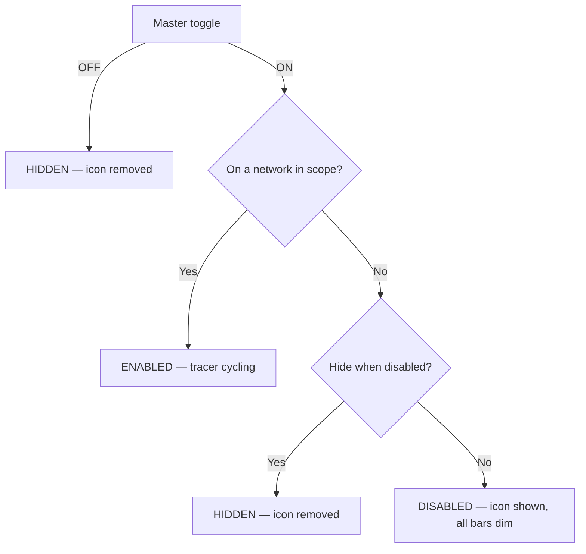

# Uplink Status Indicator — App Spec

## Overview
Android app that shows a persistent status-bar icon — in the same tray as
the signal-strength / battery icons — indicating uplink health. The icon
is one of 6 fixed frames swapped in place to create a "tracer" effect:
a 5-bar silhouette with either all bars dim, or one bar lit in one of 5
positions. The tracer is driven directly by ping activity rather than by
a separate animation timer.

## Scope
- Persistent status-bar icon (not a home-screen widget).
- Default network scope: WiFi only (battery consideration). User can
  widen scope to any connection, restrict to cellular, or whitelist
  specific SSIDs — see [User Preferences](#user-preferences).
- Discrete icon-frame swaps only — no smooth/animated rendering.
- No adaptive back-off on ping retry.

## Icon States (6 total)

| Icon               | Frame                                    | Meaning                                  |
| ------------------ | ----------------------------------------- | ----------------------------------------- |
| `ic_scan_disabled` | 5-bar silhouette, all bars dim            | Tracer paused (see state logic below)     |
| `ic_scan_1`         | 5-bar silhouette, bar 1 lit               | Tracer position 1                         |
| `ic_scan_2`         | 5-bar silhouette, bar 2 lit               | Tracer position 2                         |
| `ic_scan_3`         | 5-bar silhouette, bar 3 lit               | Tracer position 3                         |
| `ic_scan_4`         | 5-bar silhouette, bar 4 lit               | Tracer position 4                         |
| `ic_scan_5`         | 5-bar silhouette, bar 5 lit               | Tracer position 5                         |

All six are the same 5-bar shape — only the fill changes. Vector
drawables, ~24x24dp, single-color silhouette, transparent background,
following standard notification icon guidelines.

"Hidden" is **not** a 7th icon — it's the absence of the icon (nothing
shown in the status bar).

## Core Mechanism — Ping-Driven Tracer
The tracer advances one bar position per "ack." Acks come from two
sources per cycle: a successful ping reply, and a fixed timer that fires
partway through the cycle. There is no separate animation loop and no
formula that scales speed by latency — latency is simply how long step 2
below takes to happen.

Cycle, repeating while enabled:

1. Send an ICMP Echo Request (timeout: 1000ms).
2. Echo Reply arrives → **ack** → tracer advances one step, icon updates.
   A slower reply means a longer visible pause on this step — that delay
   *is* the latency indicator, nothing else scales it.
3. Wait 500ms → **ack** (automatic) → tracer advances another step.
4. Wait another 500ms (no ack).
5. Back to step 1.

**On ping timeout/failure:** no ack fires. The tracer freezes on its
current bar — it does not advance and does not show a distinct "lost"
frame. The loop retries immediately with a new Echo Request (same
1000ms timeout, no back-off) until a reply comes back, at which point
acks resume and the tracer continues from wherever it froze.

## Bar Position Persistence
Position persists only for the lifetime of the running process. An app
restart resets to bar 1 — it is not restored from preferences.

## Enabled / Disabled / Hidden — State Logic
The master toggle is checked first and is unconditional; the network
scope check (and the hide-when-disabled preference) only ever comes into
play once the master toggle is on.

- **Master toggle off → `HIDDEN`, always.** This is the whole-app
  off switch; nothing else overrides it.
- **Master toggle on, network in scope → `ENABLED`.** Ping-driven
  tracer runs as described above.
- **Master toggle on, network out of scope →** the *hide when
  disabled* preference decides between `HIDDEN` (icon removed) and
  `DISABLED` (icon shown, all bars dim, tracer paused).

## User Preferences
- **Enable/disable toggle** — master on/off for the whole feature,
  without uninstalling the app.
- **Hide when disabled** — governs only the out-of-scope case above;
  it has no effect on the master toggle, which always hides.
- **Network scope** — one of:
  - WiFi only *(default)*
  - Any connection (WiFi + cellular)
  - Cellular only
  - Specific SSID(s) — a whitelist of one or more networks; the icon
    is only enabled while connected to a listed network.
- **Ping target host** — default `1.1.1.1` (Cloudflare), with `8.8.8.8`
  (Google) offered as an alternate quick-pick; user can override with
  any custom host.

## Technical Notes
- Foreground service (`FOREGROUND_SERVICE` permission; `dataSync`
  foreground service type on Android 14+).
- `Handler`/`postDelayed` loop on the main looper; no wake lock — it's
  acceptable for Doze to throttle timers while the screen is off, since
  the icon only matters when the user can see it.
- Notification: `setOngoing(true)`, `PRIORITY_LOW`.
- Network state monitored via `ConnectivityManager.NetworkCallback`;
  transitions feed directly into the state logic above.
- Each ICMP Echo Request uses a fixed 1000ms timeout. On failure, retry
  immediately with the same timeout — no adaptive back-off.
- Only call `notify()` on an ack (tracer advance) or a state transition
  (enabled/disabled/hidden) — not on every internal timer tick.

## Explicitly Out of Scope (v1)
- Smooth/animated (non-frame-based) rendering
- Adaptive/back-off polling
- Floating overlay or home-screen widget (status-bar icon only)
- Persisting bar position across app restarts
- A distinct "lost ping" visual frame (freezing in place is the only
  failure indication)
