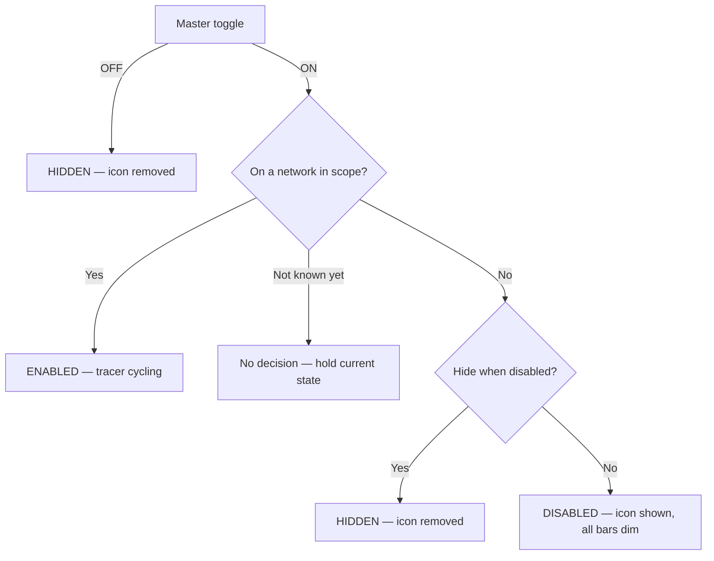

# Uplink Status Indicator — App Spec

## Overview
Android app that shows a persistent status-bar icon — in the same tray as
the signal-strength / battery icons — indicating uplink health. The icon
is one of 6 fixed frames swapped in place to create a "tracer" effect:
a 5-bar silhouette with either all bars dim, or one bar lit in one of 5
positions. The tracer is driven directly by ping activity rather than by
a separate animation timer.

## Scope
- Persistent status-bar icon (not a home-screen widget).
- Default network scope: any connection (WiFi or cellular, whichever is
  actually carrying traffic). User can narrow scope to WiFi only or
  cellular only, or whitelist specific SSIDs — see [User
  Preferences](#user-preferences).
- Discrete icon-frame swaps only — no smooth/animated rendering.
- No adaptive back-off on ping retry.

## Implementation Baseline
Locked decisions — not open questions:
- **Language/UI:** Kotlin, Jetpack Compose for all in-app UI (settings
  screen and anything else the user navigates to). Compose doesn't
  apply to the notification itself or the foreground service — those
  are standard Android notification/service APIs regardless of UI
  toolkit.
- **`minSdk` 34 (Android 14), `targetSdk` latest stable at build time.**
  No pre-14 compatibility path — this removes an entire category of
  legacy foreground-service-type branching the spec would otherwise
  need to account for, and matches the only device available for real
  testing (see below).
- **Preferences:** Jetpack DataStore (Preferences DataStore), not
  SharedPreferences.
- **Test device:** Google Pixel 6 Pro, Android 14+. This is the only
  hardware available for real-device validation — the device-testing
  protocol targets it specifically. Multi-OEM battery-management
  variance (Samsung, Xiaomi, etc.) is a known real-world risk category
  that this protocol cannot cover without that hardware; it's an
  explicit scope limit of testing, not a shortcut in the app itself.
- **Internal module/package structure** is intentionally left to
  implementation judgment rather than dictated here — reviewed for
  soundness rather than prescribed. The one hard requirement: the probe
  and tracer/ack state-machine logic must be plain Kotlin with no
  Android framework dependency, so it's unit-testable on the JVM
  without instrumentation.

## Icon States (6 total)

| Icon               | Frame                                    | Meaning                                  |
| ------------------ | ----------------------------------------- | ----------------------------------------- |
| `ic_scan_disabled` | 5-bar silhouette, all bars dim            | Tracer paused (see state logic below)     |
| `ic_scan_1`         | 5-bar silhouette, bar 1 lit               | Tracer position 1                         |
| `ic_scan_2`         | 5-bar silhouette, bar 2 lit               | Tracer position 2                         |
| `ic_scan_3`         | 5-bar silhouette, bar 3 lit               | Tracer position 3                         |
| `ic_scan_4`         | 5-bar silhouette, bar 4 lit               | Tracer position 4                         |
| `ic_scan_5`         | 5-bar silhouette, bar 5 lit               | Tracer position 5                         |

All six are the same 5-bar shape — only the fill changes. Vector
drawables, ~24x24dp, single-color silhouette, transparent background,
following standard notification icon guidelines. Duotone is achieved
through alpha only (dim bars at 0.3, the lit bar at 1.0), never through
a second fill color — the status-bar small-icon slot flattens any real
color to a single OS-applied tint and only respects alpha, so a
same-tint opacity difference is the only way to get the dim/lit look to
actually survive being rendered there.

The vector drawables for all 6 frames (`ic_scan_disabled.xml`,
`ic_scan_1.xml` … `ic_scan_5.xml`) live in `app/src/main/res/drawable/`,
where the notification-building code references them as ordinary Android
resources.

"Hidden" is **not** a 7th icon — it's the absence of the icon (nothing
shown in the status bar).

## Core Mechanism — Probe-Driven Tracer
The tracer advances one bar position per "ack." Acks come from two
sources: a successful probe response, and a fixed timer that fires
between steps. There is no separate animation loop and no formula that
scales speed by latency — latency is simply how long a probe attempt
takes to return.

**The sweep is a ping-pong bounce, not a wrap.** The lit bar moves
1→2→3→4→5, then reverses and moves back down 5→4→3→2→1, then reverses
again — never jumping straight from bar 5 back to bar 1. Bar 1 and bar
5 each appear once per direction change, not twice in a row. This is a
KITT/scanner-style motion.

**Probe, not ICMP.** Unprivileged Android apps can't open raw ICMP
sockets (no `CAP_NET_RAW`), so "ping" here is a plain TCP connect-time
probe: open a `Socket` to the target host on port 443, time how long
`connect()` takes, then close it immediately without sending or
receiving any payload. One round trip, same shape as an ICMP echo,
works under the ordinary `INTERNET` permission. (Shelling out to
`/system/bin/ping` and parsing its text output was considered and
rejected — output format isn't stable across OEMs/Android versions.)

The default probe target is a **hostname**, not a bare IP literal —
`one.one.one.one` (Cloudflare) as the default, `dns.google` offered as
an alternate quick-pick, custom host override supported. Resolving a
hostname lets the OS pick whichever address family the network actually
supports; a hardcoded IPv4 literal simply fails on an IPv6-only/NAT64
network and looks indistinguishable from a real outage. If the custom
override is a hostname and it fails to resolve, treat that as a distinct
"can't resolve target" condition rather than folding it into the
generic probe-failure case — a DNS problem and a network-down problem
shouldn't look the same to the user.

Cycle, repeating while enabled — **ping, ping, fake**, not a strict 1:1
alternation:

1. Open a probe (TCP connect to the target host:443, timeout: 1000ms).
2. Probe succeeds → **ack** → tracer advances one step, icon updates.
   A slower response means a longer visible pause on this step — that
   delay *is* the latency indicator, nothing else scales it.
3. Wait the step delay (see below) → back to step 1 for a second real
   probe.
4. Second probe succeeds → **ack** → tracer advances another step.
5. Wait the step delay → **ack** (automatic, no real probe) → tracer
   advances a third step.
6. Wait the step delay (no ack) → back to step 1.

Two real probes before each automatic ack, not one, deliberately: a
strict ping/fake/ping/fake alternation makes every freeze (see below)
land in the same phase of the bounce, so an outage always stops the
tracer on the same handful of bars. Breaking the 1:1 alternation
spreads freezes across more of the sweep instead.

**Step delay:** the wait between every step above — after a real ack,
after the automatic ack, and before the next probe — is one **user-
configurable** value, not a fixed 500ms. Settings screen: a slider,
0–1000ms, default 500ms. 0ms means back-to-back with no added wait
("free wheeling") — each step still takes however long its own probe
attempt does, but nothing artificially paces them further apart. The
same value governs every step; there's no separate rate for the real
vs. the automatic step.

**On probe timeout/failure:** no ack fires. The tracer freezes on its
current bar — it does not advance and does not show a distinct "lost"
frame. The loop retries immediately with a new probe (same 1000ms
timeout, no back-off, and no step delay before the retry — the step
delay paces *completed* steps, not failure retries) until one succeeds,
at which point acks resume and the tracer continues from wherever it
froze. A failure does not consume a slot in the ping/ping/fake
sequence — the sequence only advances on a real ack, so an outage
mid-sequence resumes at the same point once connectivity returns,
rather than restarting the pattern.

## Bar Position Persistence
Position persists only for the lifetime of the running process. An app
restart resets to bar 1 — it is not restored from preferences.

## Enabled / Disabled / Hidden — State Logic
The master toggle is checked first and is unconditional; the network
scope check (and the hide-when-disabled preference) only ever comes into
play once the master toggle is on.

- **Master toggle off → `HIDDEN`, always.** This is the whole-app
  off switch; nothing else overrides it. It resolves immediately even
  when the network state is still unknown, because this branch never
  consults the network at all.
- **Master toggle on, network in scope → `ENABLED`.** Ping-driven
  tracer runs as described above.
- **Master toggle on, network out of scope →** the *hide when
  disabled* preference decides between `HIDDEN` (icon removed) and
  `DISABLED` (icon shown, all bars dim, tracer paused).
- **Master toggle on, network scope not yet known → no decision.**
  "Connectivity hasn't reported anything yet" is a third input state,
  distinct from "reported, and we are not on a network in scope." Only
  the latter is grounds for `DISABLED`/`HIDDEN`. The connectivity layer
  keeps this window as close to zero as possible by reading the
  platform's *current* networks — the whole set, and the default route —
  synchronously when it subscribes, rather than waiting on the first
  `NetworkCallback` to arrive, so the first decision is correct even if
  those callbacks are slow or never come. Deriving a real, user-visible
  verdict from the mere absence of a report would otherwise leave a
  fresh install sitting on the paused tracer until the master toggle was
  cycled off and on.

## In-App Status Line
The settings screen carries a one-line, plain-language status field
("Status: connected, 42ms") describing what the service is doing right
now. It exists to be a small honest log the user can glance at, so its
one hard requirement is that everything it says is true at the moment it
says it — a status field that is merely present, and technically holds
text, is worse than none at all.

It is therefore fed by a closed set of confirmed states, each reported
from exactly one real transition:

| State                                                 | Reported when                                                              |
| ----------------------------------------------------- | -------------------------------------------------------------------------- |
| starting up                                            | the service has started; no visibility decision has been reached yet        |
| checking the connection                                | `ENABLED` applied and the cycle started; no probe has completed yet         |
| connected, *N*ms                                       | a probe answered (or the automatic ack that follows one fired)              |
| connection trouble / can't resolve the target host     | a probe attempt failed, named by which kind of failure it was               |
| paused / waiting for a whitelisted Wi-Fi network       | `DISABLED` applied                                                          |
| hidden                                                 | `HIDDEN` applied                                                            |
| stopped                                                | the service instance was destroyed, so nothing will update the field again  |

Until the first confirmed state arrives there is no status line on
screen at all, rather than a default or placeholder one.

Notification content never feeds this field. The notification is a
separate surface with a different obligation: Android requires one to be
posted immediately on service start, before anything has been decided,
so it necessarily carries a placeholder — and a notification built to
meet an API deadline is not evidence of a state having been reached.
That placeholder accordingly states no verdict ("Uplink: starting…")
rather than naming a network condition. For the same reason the first
notification of a fresh cycle reads "checking connection," not
"connected": the tracer sits at bar 1 because the cycle just started,
not because anything answered.

## In-App Scanner Preview
The settings screen also carries a live visual duplicate of the
status-bar icon itself, centered horizontally at the top of the screen
at roughly a quarter of the screen's width. It exists so the icon's
current frame is visible while looking at the settings screen, without
having to pull down the notification shade or glance at the status bar.

Its one hard requirement mirrors the status line's: it must always show
literally the same frame the notification is showing, not a separate
animation or a second interpretation of the tracer's state derived some
other way. It is fed from the same drawable resource the notification's
icon was just built from, updated at the same moment — never computed
independently from bar position or visibility state.

When the real icon is absent (`HIDDEN`), the preview shows nothing at
all, the same way the status bar does — this is not a seventh frame any
more than the notification's own dim-all-bars frame is, per [Icon
States](#icon-states-6-total) above. Whenever the master toggle is off,
this is what applies.

## In-App History Graphs
The settings screen carries two live rolling graphs, immediately below
the scanner preview and above the rest of the settings — a ping success
percentage and a latency trend, both over a shared, user-configurable
history window (default 7 minutes, matching Starlink's own status
display, which this is modeled on).

Both graphs are driven by real probe attempts only — the TCP-connect
probes described in [Core Mechanism](#core-mechanism--probe-driven-tracer)
above. The automatic ("fake") ack in the ping/ping/fake cycle is not a
probe attempt and contributes no sample to either graph; counting it
would silently inflate the success percentage and misrepresent the
latency trend with data that was never actually measured.

- **Ping success (%)** — the percentage of real probe attempts, within
  the window, that succeeded. Every real attempt counts, success or
  failure — including repeated immediate-retry failures during a
  sustained outage.
- **Latency (ms)** — a windowed trend line built from successful
  probes' measured round-trip time. A failed probe is a **gap** in the
  line, not a zero and not a skipped/interpolated point — a gap is the
  honest representation of "no measurement," the same principle the
  tracer's own freeze-in-place behavior already follows for a single
  failed probe.

The window length is one setting shared by both graphs (and by the
success-percentage calculation) — not two independently configurable
windows for two views into the same underlying sample history. Settings
screen: a slider, 1–30 minutes in whole-minute stops, default 7. It is
also user-resettable: an explicit action clears the accumulated sample
history immediately, independent of restarting the service. That action
sits with the graphs rather than with the preferences, and is *not*
gated on the master toggle the way the preference controls are —
clearing what is displayed has to work exactly when the user wants a
clean slate, including while the icon is switched off.

Absent an explicit reset, the sample history is session-only, matching
bar position's own per-process lifetime — a fresh service start begins
with no samples, not samples carried over from a previous run. Process
lifetime, specifically, not cycle lifetime: the history deliberately
survives the probe cycle stopping and restarting (a network dropping out
of scope and coming back), since the failures around exactly that
transition are what a connectivity history is for.

**Each card states a windowed number, and its caption names the span
that number actually covers.** The ping-success card's number is
inherently windowed; the latency card's is therefore the window's
*average* round-trip time rather than the latest single reading, so that
one caption honestly describes both. (The instantaneous latency already
has a home — the [status line](#in-app-status-line).) The caption itself
names the configured window only once the retained samples genuinely
span it; until then it names the shorter span that really exists, since
a card reading "last 7 minutes" thirty seconds into a session would be
describing six and a half minutes of data that does not exist. Before
the first probe the numbers are blank rather than zero: "nothing
measured yet" and "every probe failed" are different states and only one
of them is bad news.

Sample retention is additionally capped in absolute count, not just by
time — the window is a duration, and free-wheeling pacing (a 0ms step
delay) produces probes as fast as the network answers, which a
time-bounded-only buffer would let grow with nothing but wall-clock time
to stop it. The cap sits well above what any pacing at the widest window
reaches in normal use; when it does bite, the oldest samples go first
and the caption reports the shorter span actually covered, so the effect
is a shorter graph rather than a mislabeled one.

## User Preferences
- **Enable/disable toggle** — master on/off for the whole feature,
  without uninstalling the app.
- **Hide when disabled** — governs only the out-of-scope case above;
  it has no effect on the master toggle, which always hides.
- **Network scope** — one of:
  - Any connection (WiFi + cellular) *(default)*
  - WiFi only
  - Cellular only
  - Specific SSID(s) — a whitelist of one or more networks; the icon
    is only enabled while connected to a listed network.

  A phone normally holds several networks at once (associated with WiFi
  while cellular data is also up), and the OS picks exactly one of them
  as the default route for general traffic. The three modes that name a
  transport — WiFi only, Cellular only, Specific SSID(s) — are matched
  against *every* connected network, so "Cellular only" is in scope
  whenever cellular is connected, whether or not it is the network
  traffic is currently routed over; "WiFi only" likewise. Both can
  legitimately be in scope at the same moment.

  *Any connection* is the exception: it asks whether the device's
  internet works rather than whether a transport is present, so it is
  matched against the default route alone and is the only mode that
  requires the OS to have validated that network. The probe opens an
  unbound socket and therefore measures the default route, so this keeps
  the scope decision aligned with what the probe reports.

  A network counts as connected for all four modes when it declares
  itself an internet-carrying WiFi or cellular network. The
  special-purpose cellular connections a phone holds open regardless of
  the mobile-data setting (IMS/VoLTE, MMS, SUPL) don't declare that, and
  don't count. Validation is deliberately *not* required for the three
  transport modes: a connected-but-broken network stays in scope so the
  tracer's freeze-on-failure behavior can report it, rather than being
  hidden as out of scope.
- **Ping target host** — default `one.one.one.one` (Cloudflare), with
  `dns.google` (Google) offered as an alternate quick-pick; user can
  override with any custom host.
- **Step delay** — 0–1000ms slider, default 500ms; see [Core
  Mechanism](#core-mechanism--probe-driven-tracer) above.
- **History window** — how far back the two [history
  graphs](#in-app-history-graphs) look, and the window the ping-success
  percentage is computed over; 1–30 minute slider, default 7 minutes.

## Technical Notes
- Foreground service (`FOREGROUND_SERVICE` permission). Type:
  **`specialUse`**, not `dataSync` — `dataSync` is scoped to data
  sync/transfer workloads and, on Android 14+, is capped at 6 hours of
  cumulative runtime per rolling 24-hour window, which would just stop
  an always-on indicator outright. None of Android's other named FGS
  types (`mediaPlayback`, `location`, `phoneCall`, `connectedDevice`,
  etc.) describe "persistent connectivity status" either. `specialUse`
  is the type Android 14 added specifically as the honest fallback for
  services that don't fit a named bucket — it requires a short
  justification string in the manifest and in the Play Console
  data-safety form, but it's the correct classification here.
- `Handler`/`postDelayed` loop on a dedicated background `HandlerThread`
  — the probe itself is a blocking call, up to 1000ms, retried
  immediately with no back-off on failure per this doc, and the cycle
  runner invokes it synchronously from inside the scheduler's own
  callback; binding that to the main-thread looper would block the UI
  thread for every probe attempt and risk an ANR during a sustained
  outage's back-to-back retries. No wake lock — it's acceptable for
  Doze to throttle timers while the screen is off, since the icon only
  matters when the user can see it.
- Notification: `setOngoing(true)`. Channel importance is
  `IMPORTANCE_DEFAULT`, not `IMPORTANCE_LOW` — on-device testing showed
  `IMPORTANCE_LOW` notifications don't get a status-bar tray icon at
  all, only a shade entry, so `DEFAULT` is required for the icon to
  show. `DEFAULT` plays a one-time notification sound on first post;
  this is suppressed for later updates via `setOnlyAlertOnce(true)`.
  Also set real accessibility text via
  `setContentTitle()`/`setContentText()` (e.g. "Uplink: connected,
  42ms") — the glanceable icon itself is visual-only, but a screen
  reader should still get something from it.
- `POST_NOTIFICATIONS` runtime permission (Android 13+) must be
  requested explicitly; without it the icon can't be shown at all, so
  this needs its own request/rationale flow, not just a manifest entry.
- Network state monitored via `ConnectivityManager.NetworkCallback`;
  transitions feed directly into the state logic above. Two callbacks
  are registered: one on a `NetworkRequest` matching every
  internet-carrying WiFi/cellular network, which maintains the set of
  connected networks the transport and SSID modes are matched against,
  and one default-network callback, which tracks the single route
  *Any connection* is matched against. Neither is derivable from the
  other — the default route can be a transport the request filters out
  entirely (ethernet, or a VPN layered over the real uplink) — and
  losing one network never discards what is known about the others.
- Reading the current SSID for the network-scope whitelist requires
  `ACCESS_FINE_LOCATION` (Android 10+ OS restriction — no way around
  it). Request this permission only when the user actually turns on
  SSID whitelisting, not up front, so the base app doesn't need a
  location permission most users will never trigger.
- The SSID a `NetworkCallback` delivers is redacted according to the
  app's location permission *as of the moment that capabilities object
  was dispatched*, and the OS never revisits that decision for an object
  already delivered. Since granting the permission changes nothing about
  the network itself, the OS has no reason to dispatch a replacement:
  a device that stays on one WiFi network can keep reporting an
  unreadable SSID indefinitely after the grant — permanently out of
  scope under a whitelist naming that exact network. The app therefore
  announces its own location-permission changes (from the permission
  request result, and on activity resume for a grant made in system
  settings), and the connectivity layer answers each one with a fresh
  synchronous read of the platform's current networks, whose values
  reflect the permission state as it is now. This is additive to the
  callbacks, which remain the source of truth for every genuine network
  change; a refresh replaces the whole picture rather than patching part
  of it, and a platform that refuses the query leaves what is already
  known untouched.
- Each probe uses a fixed 1000ms timeout. On failure, retry immediately
  with the same timeout — no adaptive back-off.
- Only call `notify()` on an ack (tracer advance) or a state transition
  (enabled/disabled/hidden) — not on every internal timer tick.

## Explicitly Out of Scope (v1)
- Smooth/animated (non-frame-based) rendering
- Adaptive/back-off polling
- Floating overlay or home-screen widget (status-bar icon only)
- Persisting bar position across app restarts
- A distinct "lost ping" visual frame (freezing in place is the only
  failure indication)
- **iOS / cross-platform.** This is Android-only by design, not just for
  v1. Third-party iOS apps have no API to inject or update an icon in
  the system status bar, so the core mechanic doesn't port — the
  closest iOS analog (a Live Activity in the Dynamic Island / Lock
  Screen) is a different UI surface with different constraints (no
  continuous background execution; updates are foreground-only or
  rate-limited push), not a recompile of this spec. Revisit as a
  separate, parallel design if iOS support is ever pursued.
