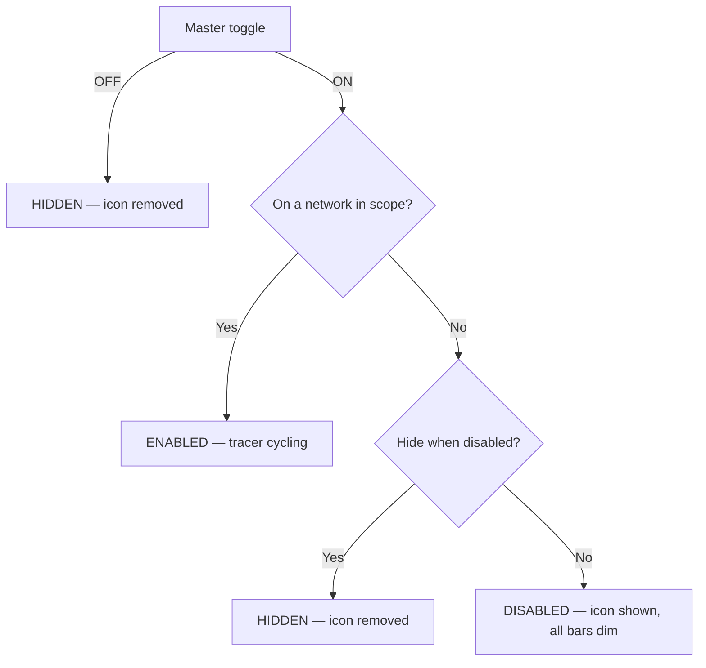

# Uplink Status Indicator — App Spec

## Overview
Android app that shows a persistent status-bar icon — in the same tray as
the signal-strength / battery icons — indicating uplink health. The icon
is one of 6 fixed frames swapped in place to create a "tracer" effect:
a 5-bar silhouette with either all bars dim, or one bar lit in one of 5
positions. The tracer is driven directly by ping activity rather than by
a separate animation timer.

## Scope
- Persistent status-bar icon (not a home-screen widget).
- Default network scope: WiFi only (battery consideration). User can
  widen scope to any connection, restrict to cellular, or whitelist
  specific SSIDs — see [User Preferences](#user-preferences).
- Discrete icon-frame swaps only — no smooth/animated rendering.
- No adaptive back-off on ping retry.

## Implementation Baseline
Settled going into implementation, so these aren't open questions for
whoever builds this:
- **Language/UI:** Kotlin, Jetpack Compose for all in-app UI (settings
  screen and anything else the user navigates to). Compose doesn't
  apply to the notification itself or the foreground service — those
  are standard Android notification/service APIs regardless of UI
  toolkit.
- **`minSdk` 34 (Android 14), `targetSdk` latest stable at build time.**
  No pre-14 compatibility path — this removes an entire category of
  legacy foreground-service-type branching the spec would otherwise
  need to account for, and matches the only device available for real
  testing (see below).
- **Preferences:** Jetpack DataStore (Preferences DataStore), not
  SharedPreferences.
- **Test device:** Google Pixel 6 Pro, Android 14+. This is the only
  hardware available for real-device validation — the device-testing
  protocol targets it specifically. Multi-OEM battery-management
  variance (Samsung, Xiaomi, etc.) is a known real-world risk category
  that this protocol cannot cover without that hardware; it's an
  explicit scope limit of testing, not a shortcut in the app itself.
- **Internal module/package structure** is intentionally left to
  implementation judgment rather than dictated here — reviewed for
  soundness rather than prescribed. The one hard requirement: the probe
  and tracer/ack state-machine logic must be plain Kotlin with no
  Android framework dependency, so it's unit-testable on the JVM
  without instrumentation.

## Icon States (6 total)

| Icon               | Frame                                    | Meaning                                  |
| ------------------ | ----------------------------------------- | ----------------------------------------- |
| `ic_scan_disabled` | 5-bar silhouette, all bars dim            | Tracer paused (see state logic below)     |
| `ic_scan_1`         | 5-bar silhouette, bar 1 lit               | Tracer position 1                         |
| `ic_scan_2`         | 5-bar silhouette, bar 2 lit               | Tracer position 2                         |
| `ic_scan_3`         | 5-bar silhouette, bar 3 lit               | Tracer position 3                         |
| `ic_scan_4`         | 5-bar silhouette, bar 4 lit               | Tracer position 4                         |
| `ic_scan_5`         | 5-bar silhouette, bar 5 lit               | Tracer position 5                         |

All six are the same 5-bar shape — only the fill changes. Vector
drawables, ~24x24dp, single-color silhouette, transparent background,
following standard notification icon guidelines. Duotone is achieved
through alpha only (dim bars at 0.3, the lit bar at 1.0), never through
a second fill color — the status-bar small-icon slot flattens any real
color to a single OS-applied tint and only respects alpha, so a
same-tint opacity difference is the only way to get the dim/lit look to
actually survive being rendered there.

**Signed off:** the vector drawables for all 6 frames (`ic_scan_disabled.xml`,
`ic_scan_1.xml` … `ic_scan_5.xml`, originally drafted in
`assets/media/icons/`, merged in [PR #3](https://github.com/ScottKirvan/UplinkStatus/pull/3))
moved into `app/src/main/res/drawable/` in Stage 2, where the
notification-building code references them as ordinary Android resources.
The 0.3 dim alpha is still worth a real-device sanity check (tracked for
Stage 7's device-testing protocol), but the shape and duotone approach
are settled.

"Hidden" is **not** a 7th icon — it's the absence of the icon (nothing
shown in the status bar).

## Core Mechanism — Probe-Driven Tracer
The tracer advances one bar position per "ack." Acks come from two
sources per cycle: a successful probe response, and a fixed timer that
fires partway through the cycle. There is no separate animation loop and
no formula that scales speed by latency — latency is simply how long
step 2 below takes to happen.

**Probe, not ICMP.** Unprivileged Android apps can't open raw ICMP
sockets (no `CAP_NET_RAW`), so "ping" here is a plain TCP connect-time
probe: open a `Socket` to the target host on port 443, time how long
`connect()` takes, then close it immediately without sending or
receiving any payload. One round trip, same shape as an ICMP echo,
works under the ordinary `INTERNET` permission. (Shelling out to
`/system/bin/ping` and parsing its text output was considered and
rejected — output format isn't stable across OEMs/Android versions.)

The default probe target is a **hostname**, not a bare IP literal —
`one.one.one.one` (Cloudflare) as the default, `dns.google` offered as
an alternate quick-pick, custom host override supported. Resolving a
hostname lets the OS pick whichever address family the network actually
supports; a hardcoded IPv4 literal simply fails on an IPv6-only/NAT64
network and looks indistinguishable from a real outage. If the custom
override is a hostname and it fails to resolve, treat that as a distinct
"can't resolve target" condition rather than folding it into the
generic probe-failure case — a DNS problem and a network-down problem
shouldn't look the same to the user.

Cycle, repeating while enabled:

1. Open a probe (TCP connect to the target host:443, timeout: 1000ms).
2. Probe succeeds → **ack** → tracer advances one step, icon updates.
   A slower response means a longer visible pause on this step — that
   delay *is* the latency indicator, nothing else scales it.
3. Wait 500ms → **ack** (automatic) → tracer advances another step.
4. Wait another 500ms (no ack).
5. Back to step 1.

**On probe timeout/failure:** no ack fires. The tracer freezes on its
current bar — it does not advance and does not show a distinct "lost"
frame. The loop retries immediately with a new probe (same 1000ms
timeout, no back-off) until one succeeds, at which point acks resume
and the tracer continues from wherever it froze.

## Bar Position Persistence
Position persists only for the lifetime of the running process. An app
restart resets to bar 1 — it is not restored from preferences.

## Enabled / Disabled / Hidden — State Logic
The master toggle is checked first and is unconditional; the network
scope check (and the hide-when-disabled preference) only ever comes into
play once the master toggle is on.

- **Master toggle off → `HIDDEN`, always.** This is the whole-app
  off switch; nothing else overrides it.
- **Master toggle on, network in scope → `ENABLED`.** Ping-driven
  tracer runs as described above.
- **Master toggle on, network out of scope →** the *hide when
  disabled* preference decides between `HIDDEN` (icon removed) and
  `DISABLED` (icon shown, all bars dim, tracer paused).

## User Preferences
- **Enable/disable toggle** — master on/off for the whole feature,
  without uninstalling the app.
- **Hide when disabled** — governs only the out-of-scope case above;
  it has no effect on the master toggle, which always hides.
- **Network scope** — one of:
  - WiFi only *(default)*
  - Any connection (WiFi + cellular)
  - Cellular only
  - Specific SSID(s) — a whitelist of one or more networks; the icon
    is only enabled while connected to a listed network.
- **Ping target host** — default `one.one.one.one` (Cloudflare), with
  `dns.google` (Google) offered as an alternate quick-pick; user can
  override with any custom host. (Corrected in Stage 5: this bullet
  previously said `1.1.1.1`/`8.8.8.8` — bare IP literals — which
  directly contradicted the "Core Mechanism" section above and was
  simply stale text left over from before that section's hostname-vs-
  literal reasoning was written. The implementation has always used the
  hostname defaults, matching Core Mechanism and
  `ProbeTarget.DEFAULT_HOST`/`ProbeTarget.ALTERNATE_HOST`; only this
  bullet's wording was wrong.)

## Technical Notes
- Foreground service (`FOREGROUND_SERVICE` permission). Type:
  **`specialUse`**, not `dataSync` — `dataSync` is scoped to data
  sync/transfer workloads and, on Android 14+, is capped at 6 hours of
  cumulative runtime per rolling 24-hour window, which would just stop
  an always-on indicator outright. None of Android's other named FGS
  types (`mediaPlayback`, `location`, `phoneCall`, `connectedDevice`,
  etc.) describe "persistent connectivity status" either. `specialUse`
  is the type Android 14 added specifically as the honest fallback for
  services that don't fit a named bucket — it requires a short
  justification string in the manifest and in the Play Console
  data-safety form, but it's the correct classification here.
- `Handler`/`postDelayed` loop on a dedicated background `HandlerThread`
  (**revised in Stage 2** from an earlier draft that said "the main
  looper" — the probe itself is a blocking call, up to 1000ms, retried
  immediately with no back-off on failure per this doc, and the cycle
  runner invokes it synchronously from inside the scheduler's own
  callback; binding that to the real main-thread looper would block the
  UI thread for every probe attempt and risk an ANR outright during a
  sustained outage's back-to-back retries). No wake lock — it's still
  acceptable for Doze to throttle timers while the screen is off, since
  the icon only matters when the user can see it; that reasoning doesn't
  depend on which thread the `Handler` runs on.
- Notification: `setOngoing(true)`, `PRIORITY_LOW`. Also set real
  accessibility text via `setContentTitle()`/`setContentText()` (e.g.
  "Uplink: connected, 42ms") — the glanceable icon itself is
  visual-only, but a screen reader should still get something from it.
- `POST_NOTIFICATIONS` runtime permission (Android 13+) must be
  requested explicitly; without it the icon can't be shown at all, so
  this needs its own request/rationale flow, not just a manifest entry.
- Network state monitored via `ConnectivityManager.NetworkCallback`;
  transitions feed directly into the state logic above.
- Reading the current SSID for the network-scope whitelist requires
  `ACCESS_FINE_LOCATION` (Android 10+ OS restriction — no way around
  it). Request this permission only when the user actually turns on
  SSID whitelisting, not up front, so the base app doesn't need a
  location permission most users will never trigger.
- Each probe uses a fixed 1000ms timeout. On failure, retry immediately
  with the same timeout — no adaptive back-off.
- Only call `notify()` on an ack (tracer advance) or a state transition
  (enabled/disabled/hidden) — not on every internal timer tick.

## Explicitly Out of Scope (v1)
- Smooth/animated (non-frame-based) rendering
- Adaptive/back-off polling
- Floating overlay or home-screen widget (status-bar icon only)
- Persisting bar position across app restarts
- A distinct "lost ping" visual frame (freezing in place is the only
  failure indication)
- **iOS / cross-platform.** This is Android-only by design, not just for
  v1. Third-party iOS apps have no API to inject or update an icon in
  the system status bar, so the core mechanic doesn't port — the
  closest iOS analog (a Live Activity in the Dynamic Island / Lock
  Screen) is a different UI surface with different constraints (no
  continuous background execution; updates are foreground-only or
  rate-limited push), not a recompile of this spec. Revisit as a
  separate, parallel design if iOS support is ever pursued.
